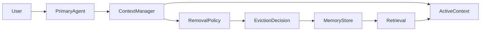

# ctx-rm Architecture

> Status note: this is an early design sketch. For the current public command
> surface and the Phase B0 evaluation stack, start with `README.md` and
> `docs/eval/README.md`.

System design for a context-removal manager that evicts low-value content from the active context while preserving evicted material in a retrievable store.

---

## Overview



The **Primary Agent** ingests content freely. The **Context Manager** monitors the active context, applies a **Removal Policy** to decide what to evict, moves evicted content to a **Memory Store**, and can **Retrieve** it back into the active context when needed.

---

## Components

### Primary Agent

The main LLM agent (e.g., via Gemini CLI or local model). It operates on whatever is in the active context. It does not need to know about eviction; the context manager runs in the background.

### Context Manager

- **Responsibilities:** Track active context size, trigger eviction when budget is exceeded, apply removal policy, persist evicted content, maintain audit log.
- **Interface:** Receives message/segment events; returns updated active context for the next turn.

### Active Context

The in-memory buffer passed to the LLM each turn. Contains:
- **Pinned segments:** Never evicted (e.g., system prompt, critical instructions).
- **Volatile segments:** Eligible for eviction (e.g., older turns, tool outputs, retrieved docs).

### Removal Policy

Determines *what* to evict and *when*. Policy implementations:

| Policy | Criterion | Use Case |
|--------|-----------|----------|
| **Recency** | Evict oldest first (FIFO) | Simple, predictable |
| **Task relevance** | Embedding similarity to current query/task | RAG-heavy sessions |
| **Salience scoring** | LLM or small model scores importance | Quality-aware eviction |
| **Budget-aware** | Evict until under token budget | Hard limits |
| **Summarization fallback** | Replace evicted block with short summary | Preserve gist |

Policies can be composed (e.g., recency + budget, or salience + task relevance).

### Memory Store

Persistent storage for evicted content. Supports:
- **Add:** Store evicted segment with metadata (timestamp, source, salience, embedding).
- **Search:** Retrieve by embedding similarity or keyword.
- **Audit:** List evictions with "why removed" traces.

Pluggable backends: SQLite + vector extension, Chroma, FAISS, etc. Local-first by default.

### Eviction Decision

Output of the removal policy: which segments to evict, in what order. The context manager applies these decisions and updates the active context.

---

## Data Model

### Message Chunk / Segment

```text
Segment:
  id: str
  content: str
  role: "system" | "user" | "assistant"
  timestamp: datetime
  token_count: int
  pinned: bool
  salience_score?: float
  embedding?: vector
  metadata?: dict
```

### Memory Tiers

| Tier | Location | Evictable | Retrievable |
|------|----------|-----------|-------------|
| **Pinned** | Active context | No | N/A |
| **Volatile** | Active context | Yes | N/A (until evicted) |
| **Evicted** | Memory store | N/A | Yes |

---

## Transparency

- **Audit log:** Every eviction recorded with segment id, policy, reason, timestamp.
- **Reversible reconstruction:** Evicted content can be re-injected into active context via retrieval.
- **"Why removed" traces:** Policy can attach a short explanation (e.g., "low salience", "oldest turn").

---

## Evaluation Design

### Baselines

1. **Full-context:** No eviction; entire session in active context (upper bound on quality, lower bound on efficiency).
2. **Minimal-context:** Fixed small window (e.g., last N turns); no retrieval (lower bound on quality, upper bound on efficiency).

### Treatment

**ctx-rm:** Minimal active context + removal policy + memory store + retrieval. Goal: approach full-context quality with minimal-context token usage.

### Metrics

| Metric | Description |
|--------|-------------|
| **Task success** | Accuracy on LongBench-style QA, summarization, code completion |
| **Retrieval accuracy** | When a needle is evicted, can it be retrieved when needed? |
| **Token usage** | Total input tokens per session |
| **Latency** | Time per turn (including eviction + retrieval overhead) |

### Evaluation Tasks

- **LongBench v1/v2 subsets:** Single-doc QA, multi-doc QA, summarization.
- **Synthetic needle tests:** Inject a fact in the middle of long context; evict; ask about it; measure retrieval success.
- **Session length sweep:** Vary session length (10, 50, 200 turns) and compare full vs ctx-rm.

---

## Tech Stack (Proposed)

| Layer | Choice | Rationale |
|-------|--------|------------|
| **Runtime** | Python 3.12 | Modern, widely supported |
| **Package manager** | Astral uv | Fast, reproducible |
| **Config** | Pydantic | Validation, env overrides |
| **CLI** | Typer | Clean subcommands |
| **Logging** | Rich | Readable output |
| **Event log** | SQLite | Local, no setup |
| **Vector store** | Pluggable (Chroma, FAISS, sqlite-vec) | Local-first, optional |
| **LLM adapters** | Gemini CLI, Ollama/llama.cpp | Target providers |

---

## Integration Points

### CLI-First Architecture (Implemented)

ctx-rm drives agents in **headless mode** via subprocess, using their subscription-based access:

#### Gemini CLI
```bash
gemini -p "<prompt>" --output-format json -m gemini-2.5-pro --yolo
```
- Uses `--output-format json` for structured response parsing
- `--yolo` mode for auto-approving tool calls during automated evaluation runs
- Token stats extracted from response JSON (`stats.models.*.tokens`)

#### Claude Code
```bash
claude -p "<prompt>" --output-format json --model sonnet --dangerously-skip-permissions
```
- Uses `--output-format json` for structured response parsing
- `--dangerously-skip-permissions` for auto-approval during automated evaluation runs
- `--max-turns` for controlling agentic loop depth

### Context Flow (Per Turn)

1. Harness constructs prompt with ctx-rm's active segments as `<context>` block
2. Invokes CLI agent via subprocess with the prompt
3. Parses JSON response for text + token usage stats
4. Ingests response as new assistant segment into ContextBus
5. Background Watcher triggers eviction if over budget
6. Next turn: ContextBus renders only active segments as context

### Provider-Agnostic Driver Interface

```python
class AgentDriver(ABC):
    async def invoke(prompt, context, working_dir, timeout) -> AgentResponse
    async def check_available() -> bool
```

Adapters: `GeminiCLIDriver`, `ClaudeCodeDriver`. Extensible to any CLI agent.
