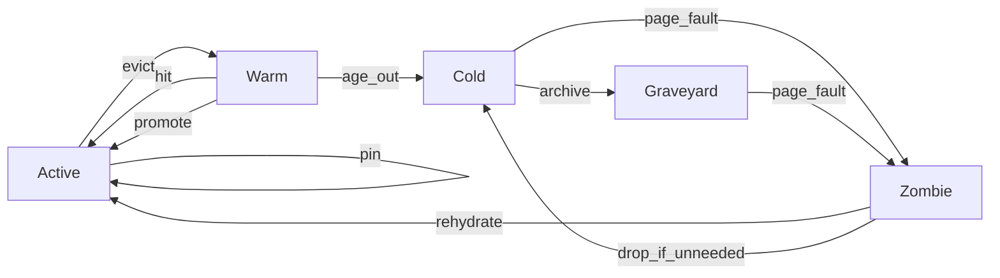

# Tiered Graveyard Architecture

This document defines a **tiered eviction system** for `ctx-rm`, explicitly grounded in OS virtual memory page replacement and database buffer pool management. It provides: mappings, tier definitions, concrete Python data structures, and state transition diagrams. The goal is a **theoretical foundation** for a multi-tier context manager that preserves recoverability and minimizes active-context noise.

---

## 1) Concept Mapping (OS / DB -> LLM Context)

| OS / DB Concept | LLM Context Mapping |
|---|---|
| Page | Context segment (turn, tool output, doc chunk) |
| Buffer pool | Active context window |
| Hot pages | Active tier (highest priority to keep) |
| Recently evicted pages | Warm tier (fast recall) |
| On-disk pages | Cold tier (persistent store) |
| Archive / history | Graveyard tier (append-only archive) |
| Page fault | Zombie stage (recall path) |
| Pin / lock | Pinned segments (non-evictable) |
| Usage count / ref bit | Access metadata (recency, frequency) |

The key framing: **Active = buffer pool hot pages**, **Warm = recently evicted but cached**, **Cold = on-disk**, **Graveyard = archived**, **Zombie = page fault recall**.

---

## 2) Tiers and Responsibilities

### Active (Hot Buffer Pool)
- **Goal:** Keep the highest-value segments in the prompt context.
- **Budget:** Hard token budget (size-bounded).
- **Properties:** Fastest access; pinned segments are always here.

### Warm (Recent Evictions)
- **Goal:** Hold recently evicted segments in memory for fast recall.
- **Budget:** Memory bounded; used to absorb churn.
- **Analogy:** OS page cache or ghost cache in ARC.

### Cold (On-Disk Store)
- **Goal:** Persist evicted segments in a durable store.
- **Budget:** Disk-bound; can be indexed (embeddings / keyword).
- **Analogy:** Database disk pages.

### Graveyard (Archive)
- **Goal:** Long-term, append-only history for audit or replay.
- **Budget:** Cheap storage; immutable; compression friendly.
- **Analogy:** WAL/archival logs, cold storage.

### Zombie (Page-Fault Recall)
- **Goal:** Transitional state when a cold/graveyard segment is requested.
- **Budget:** Small staging; controlled re-entry to Active.
- **Analogy:** Page fault handling + rehydration.

---

## 3) State Transition Diagram



Notes:
- **page_fault** is an explicit transition where a missing segment is recalled.
- **Zombie** is a staging area for validation (e.g., relevance checks) before re-entering Active.

---

## 4) Eviction Algorithms and Mapping

### LRU (Least Recently Used)
**OS meaning:** Evict the page with oldest access time.
**ctx-rm mapping:** Active/Warm use LRU to keep recently used context.
- **Data structure:** `collections.OrderedDict` for O(1) updates.
- **Tier usage:** Active, Warm.

### LFU (Least Frequently Used)
**OS meaning:** Evict the page with the lowest access count.
**ctx-rm mapping:** Bias toward segments repeatedly referenced across turns.
- **Data structure:** min-heap keyed by frequency or `collections.Counter` + heap.
- **Tier usage:** Active or Warm (when frequency is strong signal).

### CLOCK (Second Chance)
**OS meaning:** Approximate LRU using a circular list and a ref bit.
**ctx-rm mapping:** Efficient eviction without maintaining full ordering.
- **Data structure:** circular list + `ref_bit` + pointer index.
- **Tier usage:** Active (fast, low overhead).

### ARC (Adaptive Replacement Cache)
**OS meaning:** Balance recency and frequency with adaptive ghost lists.
**ctx-rm mapping:** Adapt when tasks flip between short-lived and repeated needs.
- **Key sets:** `T1` (recent), `T2` (frequent), `B1`/`B2` (ghosts).
- **Tier usage:** Active/Warm control; ghost lists influence admissions.

### 2Q
**OS meaning:** Distinguish single-touch from multi-touch pages.
**ctx-rm mapping:** Separate one-off context (A1in/A1out) from persistent (Am).
- **Key sets:** `A1in`, `A1out`, `Am`.
- **Tier usage:** Warm = `A1out` ghost; Active = `Am`.

---

## 5) Database Buffer Pool Mapping

### PostgreSQL
- **Policy:** Clock-sweep with `usage_count` and pinning.
- **Mapping:** Active tier uses **CLOCK**; `usage_count` is the ref bit depth.
- **Sequential scan ring buffer:** Avoid polluting Active with scan noise.
  - **Mapping:** Route scan-derived segments to Warm or Cold directly.

### MySQL InnoDB
- **Policy:** LRU list split into **new** and **old** sublists.
- **Mapping:** Active "new" list; Warm "old" list (midpoint insertion).
- **Insertion rule:** New pages enter the "old" region first; promote to "new" only on re-access.
  - **Mapping:** Newly retrieved segments land in Warm; promote to Active only if reused.

---

## 6) Tiered Eviction Policy (Design Summary)

### Admission Control
1. **New segments** arrive into Active *or* Warm depending on source:
   - Tool outputs / large file reads -> Warm (avoid polluting Active).
   - User instructions / task-critical -> Active.
2. **Pinned segments** stay in Active (never evicted).

### Eviction Flow
1. Evict from Active using LRU/CLOCK/ARC (policy-selectable).
2. Place evicted segments into Warm (recent cache).
3. Age Warm to Cold via size/TTL.
4. Cold segments are persisted (vector index + content store).
5. Periodically archive Cold into Graveyard (append-only).

### Recall Flow (Zombie)
1. Query misses Active/Warm -> **page_fault** from Cold/Graveyard.
2. Rehydrate into Zombie (staging).
3. Validate relevance (embedding or rule check).
4. Promote to Active (or drop back to Cold).

---

## 7) Concrete Python Data Structures

### Segment Record (Core Unit)
```python
from dataclasses import dataclass, field
from typing import Optional, Dict
import time

@dataclass
class Segment:
    seg_id: str
    content: str
    role: str  # "system" | "user" | "assistant" | "tool"
    tokens: int
    pinned: bool = False
    created_at: float = field(default_factory=time.time)
    last_access: float = field(default_factory=time.time)
    access_count: int = 0
    tier: str = "active"  # active|warm|cold|graveyard|zombie
    metadata: Dict[str, str] = field(default_factory=dict)
    embedding_ref: Optional[str] = None
    summary_ref: Optional[str] = None
```

### LRU-Style Active + Warm
```python
from collections import OrderedDict

class LRUCache:
    def __init__(self, max_items: int):
        self.max_items = max_items
        self.store = OrderedDict()  # seg_id -> Segment

    def get(self, seg_id: str):
        if seg_id in self.store:
            self.store.move_to_end(seg_id)
            return self.store[seg_id]
        return None

    def put(self, seg: Segment):
        self.store[seg.seg_id] = seg
        self.store.move_to_end(seg.seg_id)
        if len(self.store) > self.max_items:
            return self.store.popitem(last=False)  # evicted (oldest)
        return None
```

### CLOCK for Active
```python
class ClockCache:
    def __init__(self, max_items: int):
        self.max_items = max_items
        self.ring = []  # list of (seg_id, ref_bit)
        self.index = 0
        self.map = {}  # seg_id -> Segment

    def access(self, seg_id: str):
        # set ref bit on access
        for i, (sid, ref) in enumerate(self.ring):
            if sid == seg_id:
                self.ring[i] = (sid, 1)
                return self.map[sid]
        return None

    def insert(self, seg: Segment):
        if len(self.map) < self.max_items:
            self.map[seg.seg_id] = seg
            self.ring.append((seg.seg_id, 1))
            return None
        # evict by clock sweep
        while True:
            sid, ref = self.ring[self.index]
            if ref == 0:
                evicted = self.map.pop(sid)
                self.ring[self.index] = (seg.seg_id, 1)
                self.map[seg.seg_id] = seg
                self.index = (self.index + 1) % len(self.ring)
                return evicted
            self.ring[self.index] = (sid, 0)
            self.index = (self.index + 1) % len(self.ring)
```

### ARC Ghost Lists (Warm Control)
```python
from collections import OrderedDict

class ARCGhosts:
    def __init__(self, max_ghost: int):
        self.max_ghost = max_ghost
        self.B1 = OrderedDict()  # ghost of T1 (recency)
        self.B2 = OrderedDict()  # ghost of T2 (frequency)

    def record_eviction(self, seg_id: str, from_T1: bool):
        ghost = self.B1 if from_T1 else self.B2
        ghost[seg_id] = time.time()
        ghost.move_to_end(seg_id)
        if len(ghost) > self.max_ghost:
            ghost.popitem(last=False)
```

### Cold + Graveyard (Persistent)
```python
class ColdStore:
    def __init__(self):
        self.index = {}  # seg_id -> storage_ref

    def persist(self, seg: Segment):
        # write to disk/DB, store ref
        self.index[seg.seg_id] = f"disk://{seg.seg_id}"

class Graveyard:
    def __init__(self):
        self.archive_log = []  # append-only log of segment refs

    def archive(self, seg: Segment):
        self.archive_log.append(seg.seg_id)
```

### Zombie Recall Queue
```python
from collections import deque

class ZombieQueue:
    def __init__(self, max_items: int):
        self.max_items = max_items
        self.queue = deque()

    def enqueue(self, seg: Segment):
        if len(self.queue) >= self.max_items:
            self.queue.popleft()
        seg.tier = "zombie"
        self.queue.append(seg)
```

---

## 8) Policy Composition Examples

### LRU + InnoDB-Style Admission
- New segments land in **Warm**.
- Only segments that are accessed again are promoted to **Active**.
- Active uses LRU; Warm uses FIFO.

### CLOCK + ARC Ghosting
- Active uses CLOCK for low-overhead eviction.
- Warm uses ARC ghost lists to adaptively shift between recency and frequency.

### 2Q for Context Noise Control
- `A1in`: segments seen once (recent tool outputs).
- `Am`: segments seen twice (persistent relevance).
- `A1out`: ghost list for one-hit segments.

---

## 9) Design Implications for ctx-rm

- **Recoverability is first-class:** all evicted content is recallable (Cold/Graveyard).
- **Eviction is continuous and asynchronous:** background policies remove low-value content without agent interruption.
- **Admission is conservative:** prefer Warm for large tool outputs, promote on reuse.
- **Policies are swappable:** LRU/LFU/CLOCK/ARC/2Q can be toggled by workload.
- **Zombie staging avoids thrash:** page-faulted content re-enters Active only if validated as relevant.

This tiered architecture bridges OS/DB theory with LLM context management, enabling **predictable, recoverable, and adaptive eviction** across long-horizon tasks.

